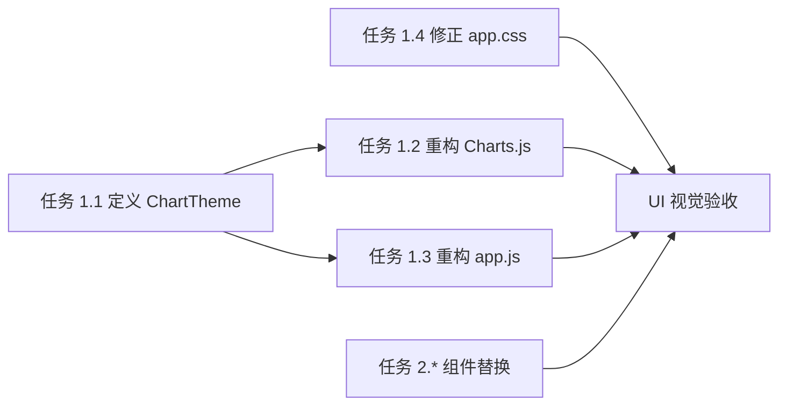

# 功能规划：前端配色标准化实施计划

**规划时间**：2026-02-10
**预估工作量**：8 任务点

---

## 1. 功能概述

### 1.1 目标
消除前端代码中的颜色定义不一致和硬编码问题，建立基于 Slate 色系的统一中性色标准，并实现图表颜色的集中管理，从而提升 UI 一致性和代码可维护性。

### 1.2 范围
**包含**：
- 创建图表颜色主题配置 (`src/public/utils.js` 或新文件)
- 重构 `Charts.js` 和 `app.js` 以使用集中配置
- 修正 `app.css` 中的硬编码滚动条颜色
- 全局替换 `gray-*` Tailwind 类名为 `slate-*`

**不包含**：
- 引入 CSS 预处理器或构建工具
- 修改品牌主色（Indigo）
- 重设计现有组件结构

### 1.3 技术约束
- **CDN Tailwind**：无法通过 `tailwind.config.js` 定义新的 CSS 变量，需在 JS 中模拟或直接使用类名。
- **双主题**：必须确保修改后的配置能正确响应 `class="dark"` 的切换。
- **兼容性**：Chart.js 的配置必须通过 JS 对象注入颜色。

---

## 2. WBS 任务分解

### 2.1 分解结构图

```mermaid
graph TD
    A[配色标准化] --> B[基础架构 (High)]
    A --> C[硬编码修复 (High)]
    A --> D[组件标准化 (Medium)]

    B --> B1[定义 ChartTheme]

    C --> C1[重构 Charts.js]
    C --> C2[重构 app.js]
    C --> C3[修正 app.css]

    D --> D1[基础 UI 组件]
    D --> D2[布局组件]
    D --> D3[业务组件]
```

### 2.2 任务清单

#### 阶段 1：基础架构与硬编码修复（4 任务点）

**目标**：消除最难维护的 Hex 值，建立图表颜色的一致性来源。

- [ ] **任务 1.1**：定义图表主题配置（1 点）
  - **文件**: `src/public/utils.js` (建议在此扩展，避免增加过多文件请求)
  - **输入**：UI/UX 报告中的 `CHART_COLORS` 定义
  - **输出**：全局可访问的 `window.ChartTheme` 对象或 `getChartColors()` 函数
  - **关键步骤**：
    1. 定义 `slate` 色系的 Hex 值映射（Light/Dark）。
    2. 创建 `getChartColors(isDark)` 函数，返回对应的 text, grid, primary, success 等颜色值。
    3. 确保该函数能在 `window` 对象上访问。

- [ ] **任务 1.2**：重构 `Charts.js`（1 点）
  - **文件**: `src/public/components/Charts.js`
  - **输入**：`window.ChartTheme`
  - **输出**：无硬编码 Hex 值的图表组件
  - **关键步骤**：
    1. 移除组件内部的 `theme === 'dark' ? '#...' : '#...'` 三元表达式。
    2. 使用 `getChartColors(theme === 'dark')` 获取颜色对象。
    3. 替换 `ticks`, `grid`, `title` 等配置中的颜色值。

- [ ] **任务 1.3**：重构 `app.js` 图表配置（1 点）
  - **文件**: `src/public/app.js`
  - **输入**：`window.ChartTheme`
  - **输出**：使用统一配置的图表实例
  - **关键步骤**：
    1. 定位 `renderStatusChart`, `renderModelChart` 等函数。
    2. 替换硬编码的 `backgroundColor` 和 `borderColor` 数组。
    3. 确保图表初始化时能正确读取当前主题颜色。

- [ ] **任务 1.4**：修正 `app.css` 滚动条（1 点）
  - **文件**: `src/public/styles/app.css`
  - **输入**：Slate 色系 Hex 值
  - **输出**：符合 Slate 风格的滚动条样式
  - **关键步骤**：
    1. Light mode thumb: `#cbd5e1` (slate-300) -> 确认或微调
    2. Light mode hover: `#94a3b8` (slate-400) -> 确认或微调
    3. Dark mode thumb: `#475569` (slate-600) -> 确认或微调
    4. Dark mode hover: `#64748b` (slate-500) -> 确认或微调

#### 阶段 2：组件类名标准化（4 任务点）

**目标**：统一 UI 风格，全部迁移至 Slate 色系。

- [ ] **任务 2.1**：基础 UI 组件替换（1 点）
  - **文件**:
    - `src/public/components/ui/Card.js`
    - `src/public/components/ui/Button.js`
    - `src/public/components/ui/Badge.js`
    - `src/public/components/ui/Modal.js`
  - **关键步骤**：
    1. 全局搜索 `gray-` 并替换为 `slate-`。
    2. 检查 `Button.js` 的 `secondary` 变体，确保边框颜色一致 (`border-slate-300`)。
    3. 检查 `Card.js` 的边框和分割线颜色 (`border-slate-200`)。

- [ ] **任务 2.2**：布局组件替换（1 点）
  - **文件**:
    - `src/public/components/TopNavBar.js`
    - `src/public/components/PageShell.js`
    - `src/public/components/*Shell.js` (Tab shells)
  - **关键步骤**：
    1. 替换导航栏分割线颜色。
    2. 替换背景色 `bg-gray-50` 为 `bg-slate-50` (需检查 `index.html` body class)。
    3. 确保文字颜色统一为 `text-slate-600/900`。

- [ ] **任务 2.3**：业务组件替换（1 点）
  - **文件**:
    - `src/public/components/StatsGrid.js`
    - `src/public/components/AccountsTable.js`
    - `src/public/components/LogsTable.js`
    - `src/public/components/SettingsPanel.js`
  - **关键步骤**：
    1. 替换表格边框、表头背景。
    2. 替换统计卡片的文字颜色。
    3. 替换设置面板的输入框边框颜色。

- [ ] **任务 2.4**：全局入口与 HTML（1 点）
  - **文件**: `src/public/index.html`
  - **关键步骤**：
    1. 修改 `<body>` 标签的 class：`bg-gray-50` -> `bg-slate-50`。
    2. 确保 `text-slate-900` 等全局样式已正确应用。

---

## 3. 依赖关系

### 3.1 依赖图



### 3.2 依赖说明

| 任务 | 依赖于 | 原因 |
|------|--------|------|
| 任务 1.2, 1.3 | 任务 1.1 | 需要先有统一的颜色配置对象才能进行引用替换 |
| 任务 2.* | 无 | 可以与任务 1 并行执行，但建议先完成任务 1 以验证核心逻辑 |

---

## 4. 实施建议

### 4.1 风险评估

| 风险 | 影响 | 缓解措施 |
|------|------|----------|
| **替换误伤** | 中 | `gray-` 可能在某些特定库（非 Tailwind）中使用，虽然本项目似乎纯 Tailwind，但仍需小心。**策略**：使用精确匹配 `gray-`，并人工审查 Diff。 |
| **图表主题切换延迟** | 低 | 确保 `Charts.js` 中的 `useEffect` 监听了 `theme` 变化，并在变化时重新获取颜色配置。 |
| **CDN 缓存** | 低 | 这是一个静态文件修改，确保开发环境禁用缓存测试。 |

### 4.2 测试策略

- **视觉回归测试**：
    - 打开页面，对比 Light/Dark 模式下的背景、文字、边框颜色是否和谐（偏蓝灰 vs 纯灰）。
    - 检查滚动条在两种模式下的颜色。
- **功能测试**：
    - 切换主题开关，观察图表（Chart.js）是否实时更新颜色（网格线、文字、Tooltip）。
    - 检查表格斑马纹、Hover 状态是否正常。

---

## 5. 验收标准

- [ ] `src/public` 目录下无 `gray-` 开头的 Tailwind 类名（第三方库除外）。
- [ ] `app.css` 中无非 Slate 色系的 Hex 值。
- [ ] `Charts.js` 和 `app.js` 中无硬编码的颜色 Hex 值。
- [ ] 页面在 Light 模式下背景为 `slate-50`，Dark 模式下为 `slate-950`（或 `slate-900`）。
- [ ] 滚动条颜色与当前主题匹配。
- [ ] 构建/运行无报错。

---

## 6. UI/UX 设计分析报告摘要

### 配色系统现状
- **主色调**：Indigo 系列（品牌色）
- **中性色问题**：混用 `gray` 和 `slate` 系列
- **硬编码问题**：图表组件和滚动条样式存在大量 Hex 值

### 标准化建议
1. **统一中性色**：全部使用 Slate 色系
2. **图表颜色管理**：创建 `ChartTheme` 配置对象
3. **语义化命名**：为未来扩展预留设计系统 Token

### 推荐色板

| 语义 | Light Mode | Dark Mode |
|------|------------|-----------|
| Primary | `indigo-600` | `indigo-500` |
| Background | `slate-50` / `white` | `slate-950` / `slate-900` |
| Text (Main) | `slate-900` | `slate-100` |
| Text (Sub) | `slate-600` | `slate-400` |
| Border | `slate-200` | `slate-800` |
| Success | `emerald-600` | `emerald-500` |
| Warning | `amber-500` | `amber-400` |
| Danger | `rose-600` | `rose-500` |
| Info | `blue-600` | `blue-500` |
