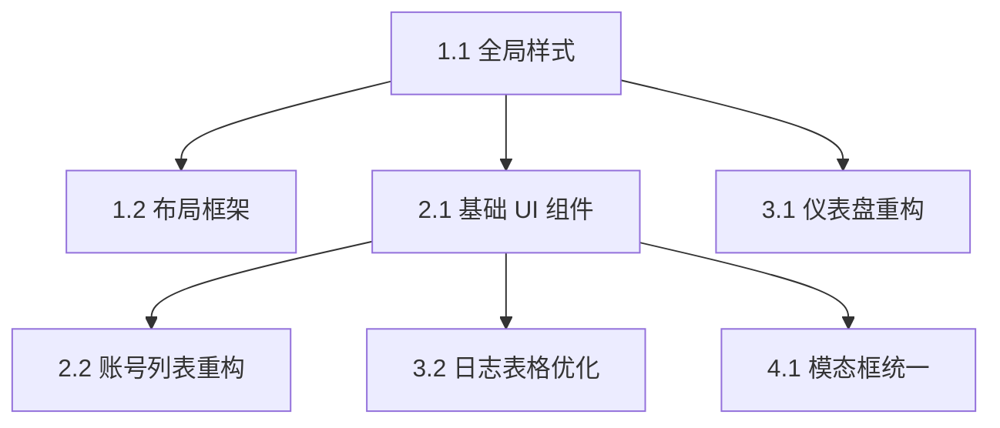

# 功能规划：Kiro2api-Node UI/UX 重新设计

**规划时间**：2026-02-10
**预估工作量**：24 任务点
**Phase 1 (基础架构)**：8 点
**Phase 2 (核心组件)**：8 点
**Phase 3 (数据可视化)**：5 点
**Phase 4 (润色)**：3 点

---

## 1. 功能概述

### 1.1 目标
将 Kiro2api-Node 管理面板升级为现代化的 Developer Console 风格，提升视觉质感、响应式体验和操作效率。

### 1.2 范围
**包含**：
- **设计系统**：引入 Dark Mode、新配色、全局动画。
- **布局重构**：响应式 Top Navigation、Glassmorphism Header。
- **组件库**：新增 Badge, Button, Card, Modal, ProgressBar 等基础组件。
- **页面重绘**：Dashboard (Stats), Accounts (List/Card), Logs (Table), Settings。

**不包含**：
- 后端 API 修改。
- 引入构建工具 (Webpack/Vite)。

### 1.3 技术约束
- **No-Build Architecture**: 保持 `window.Component` + Babel Standalone + UMD 模式。
- **Zero-Config Deployment**: 确保用户更新代码后无需重新安装依赖或编译。
- **Browser Compatibility**: 支持主流现代浏览器 (Chrome/Edge/Safari/Firefox)。

---

## 2. WBS 任务分解

### Phase 1: 基础架构与样式系统 (Foundation)

#### 模块 1.1: 全局样式与主题（3 任务点）

**文件**: `src/public/index.html`, `src/public/styles/app.css`, `src/public/utils.js`

- [ ] **任务 1.1.1**：实现 Dark Mode 切换逻辑（1 点）
  - **输入**：`utils.js`
  - **输出**：`toggleTheme()`, `initTheme()` 函数，持久化到 localStorage。
  - **关键步骤**：
    1. 在 `utils.js` 添加主题检测和切换逻辑。
    2. 修改 `index.html` `<body>` 添加基础背景色类 (`bg-gray-50 dark:bg-slate-950`)。
    3. 确保页面加载时无闪烁 (FOUC)。

- [ ] **任务 1.1.2**：更新 CSS 变量与动画（1 点）
  - **输入**：`app.css`
  - **输出**：新增 CSS 动画类 (`fade-in-up`, `scale-in`)，自定义滚动条样式。
  - **关键步骤**：
    1. 定义新的 `@keyframes`。
    2. 添加自定义滚动条样式 (Webkit)。

#### 模块 1.2: 布局框架重构（5 任务点）

**文件**: `src/public/components/TopNavBar.js`, `src/public/components/MainPanelShell.js`, `src/public/components/PageShell.js`

- [ ] **任务 1.2.1**：重构 TopNavBar（3 点）
  - **输入**：`TopNavBar.js`
  - **输出**：支持响应式、Dark Mode 切换、Glassmorphism 效果的新导航栏。
  - **关键步骤**：
    1. 添加 `sticky top-0 backdrop-blur` 样式。
    2. 实现 Desktop 端 Tab 导航。
    3. 实现 Mobile 端汉堡菜单 (Hamburger Menu) 和下拉抽屉。
    4. 集成 Dark Mode Toggle 按钮。

- [ ] **任务 1.2.2**：重构 MainPanelShell（2 点）
  - **输入**：`MainPanelShell.js`
  - **输出**：居中布局容器，适配 Bento Grid。
  - **关键步骤**：
    1. 调整容器 `max-w-7xl` 和 padding。
    2. 确保 `StatsGrid` 和 `TabsCardShell` 的布局容器正确嵌套。

### Phase 2: 核心组件库 (UI Kit)

#### 模块 2.1: 基础 UI 组件（4 任务点）

**文件**: `src/public/components/ui/Badge.js`, `src/public/components/ui/Button.js`, `src/public/components/ui/Card.js`, `src/public/components/ui/ProgressBar.js` (新建文件)

- [ ] **任务 2.1.1**：创建通用 UI 组件（2 点）
  - **输入**：设计规范
  - **输出**：`window.Badge`, `window.Button`, `window.Card` 组件。
  - **关键步骤**：
    1. 创建 `src/public/components/ui/` 目录。
    2. 实现各组件的 props 接口 (variant, size, children)。
    3. 在 `index.html` 中引入新文件。

- [ ] **任务 2.1.2**：创建进度条组件（1 点）
  - **输入**：设计规范
  - **输出**：`window.ProgressBar` 组件。
  - **关键步骤**：
    1. 支持 `value`, `max`, `color` 属性。
    2. 添加动画过渡效果。

#### 模块 2.2: 账号列表重构（4 任务点）

**文件**: `src/public/components/AccountsTable.js`

- [ ] **任务 2.2.1**：桌面端表格优化（2 点）
  - **输入**：`AccountsTable.js`, `Badge`, `ProgressBar`
  - **输出**：集成新组件的表格。
  - **关键步骤**：
    1. 替换原生文本状态为 `Badge`。
    2. 替换文本额度为 `ProgressBar`。
    3. 优化操作栏按钮样式。

- [ ] **任务 2.2.2**：移动端卡片视图（2 点）
  - **输入**：`AccountsTable.js`
  - **输出**：响应式列表渲染逻辑。
  - **关键步骤**：
    1. 使用 `hidden md:table` 控制表格显示。
    2. 添加 `md:hidden` 的卡片列表视图 (`flex-col`)。
    3. 确保卡片视图包含所有关键操作。

### Phase 3: 数据可视化与详情 (Data Viz)

#### 模块 3.1: 仪表盘重构（3 任务点）

**文件**: `src/public/components/StatsGrid.js`, `src/public/components/AnalyticsDashboard.js`

- [ ] **任务 3.1.1**：Bento Grid 布局（2 点）
  - **输入**：`StatsGrid.js`
  - **输出**：网格布局的统计卡片。
  - **关键步骤**：
    1. 使用 `grid-cols-1 md:grid-cols-2 lg:grid-cols-4`。
    2. 为不同指标设计差异化卡片样式。

- [ ] **任务 3.1.2**：图表样式优化（1 点）
  - **输入**：`AnalyticsDashboard.js`
  - **输出**：适配 Dark Mode 的 Chart.js 配置。
  - **关键步骤**：
    1. 更新 Chart.js 的 `borderColor`, `backgroundColor` 适配主题。
    2. 优化 Tooltip 样式。

#### 模块 3.2: 日志表格优化（2 任务点）

**文件**: `src/public/components/LogsTable.js`

- [ ] **任务 3.2.1**：日志详情优化（2 点）
  - **输入**：`LogsTable.js`
  - **输出**：增强可读性的日志列表。
  - **关键步骤**：
    1. 使用 `Badge` 显示 HTTP Method (GET/POST) 和 Status Code。
    2. 优化 JSON 详情展开视图的样式 (`pre` 块的背景色和字体)。

### Phase 4: 润色与交互 (Polish)

#### 模块 4.1: 模态框与通知（3 任务点）

**文件**: `src/public/components/modals/*.js`, `src/public/components/ToastContainer.js`

- [ ] **任务 4.1.1**：统一 Modal 样式（2 点）
  - **输入**：所有 Modal 组件
  - **输出**：统一头部、底部、遮罩样式的 Modals。
  - **关键步骤**：
    1. 提取 `ModalShell` 或统一类名。
    2. 确保所有 Modal 支持 Dark Mode。
    3. 优化输入框 Focus 状态 (`ring`).

- [ ] **任务 4.1.2**：Toast 动画优化（1 点）
  - **输入**：`ToastContainer.js`
  - **输出**：带进入/退出动画的 Toast。
  - **关键步骤**：
    1. 集成 `slide-in-right` 动画。
    2. 优化不同类型 Toast (Success/Error) 的图标和颜色。

---

## 3. 依赖关系

### 3.1 依赖图

### 3.2 关键路径

1.  **Phase 1 必须先行**：Dark Mode 和全局样式是所有组件的基础。
2.  **基础组件先行**：Badge/Button/Card 是构建复杂页面的积木。

---

## 4. 实施建议

### 4.1 风险控制

| 风险 | 影响 | 缓解措施 |
|------|------|----------|
| **样式覆盖** | 页面布局错乱 | 使用 Tailwind 的 `@layer` 或保证选择器优先级；在独立组件中测试。 |
| **Dark Mode 适配不全** | 视觉体验割裂 | 建立 Checklist，每个组件必须检查 Light/Dark 两种状态。 |
| **移动端交互困难** | 功能不可用 | 优先在移动端视图下测试点击区域和布局。 |

### 4.2 测试验证

- **视觉回归测试**：人工检查各页面在 Light/Dark 模式下的表现。
- **响应式测试**：在 375px (iPhone SE), 768px (iPad), 1440px (Desktop) 下验证布局。
- **功能回归**：确保重构后的按钮点击事件仍能触发正确的 API 调用。

---

## 5. 验收标准

- [ ] 页面支持系统级 Dark Mode 自动切换及手动切换。
- [ ] 移动端下无横向滚动条，表格转为卡片视图。
- [ ] 所有交互元素（按钮、输入框）有清晰的 Focus/Hover 状态。
- [ ] 新增组件文件被正确引入 `index.html` 且无 404 错误。
- [ ] 保持控制台无 React Key Warning 或 Class Name 错误。
